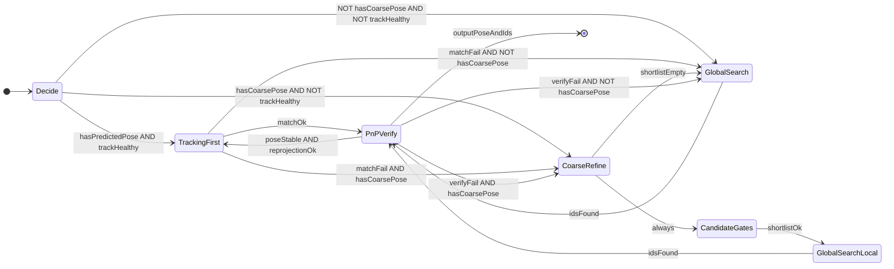
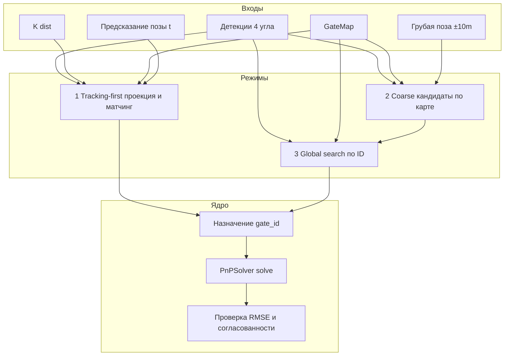

# Локализация и присвоение ID воротам (план реализации)

Документ задаёт **общий каркас**: три алгоритма **Tracking-first**, **Global search**, **Coarse prior + refine** и то, как они **комбинируются** в одном кадровом пайплайне. Детальная спецификация каждого алгоритма — в следующих итерациях (отдельные подразделы или отдельные файлы).

ТЗ на тестовые кадры и разметку: [`test_data_spec.md`](test_data_spec.md).

## 1. Цель

После детектора известны **углы ворот в 2D** (один или несколько экземпляров), но **нет `gate_id`**. Нужно:

- стабильно присвоить ID из [`config/track.json`](../config/track.json) (модель [`GateMap`](../src/gate_model/gate_model.py));
- передать в [`PnPSolver`](../src/pnp_solver/pnp_solver.py) список `(gate_id, 4×2 keypoints)` и получить позу камеры;
- явно обрабатывать ситуации: первый кадр, потеря трека, наличие только грубой позы (≈±10 m).

## 2. Входы и выходы пайплайна

| Вход | Описание |
|------|----------|
| Детекции | Список из `M` объектов: каждый — 4 точки `(x,y)` в пикселях (порядок как в датасете; допускается последующая нормализация `IDENT`/`HFLIP` на уровне PnP). |
| Камера | `K`, `dist` из [`config/camera_calibration.json`](../config/camera_calibration.json). |
| Карта | `GateMap` из `track.json`. |
| Состояние трекa | Опционально: поза камеры на `t−1`, ковариация/скорость, время кадра. |
| Грубая поза | Опционально: позиция (и желательно неопределённость) из внешнего модуля, погрешность порядка **±10 m** по горизонтали. |

| Выход | Описание |
|-------|----------|
| Присвоения | Список `(detection_index → gate_id)` или отказ с причиной. |
| Поза | Результат `PnPSolver.solve(...)` при успешном матчинге. |
| Метаданные | Режим решения (`track` / `global` / `refine`), оценка уверенности, флаги fallback. |

## 3. Схема взаимодействия (режимы и переходы)

Высокоуровневый **конечный автомат**: выбирается один основной режим, при неудаче — переход к другому по приоритету.

Смысл переходов:

- **Tracking-first** пробуем первым, когда есть предсказуемая поза и трек «здоров».
- **Coarse + refine** — когда грубая поза есть, а трек слабый или matching по проекции не прошёл.
- **Global search** — холодный старт или полный сбой; после coarse может быть **локальный** global только по сокращённому списку ворот.

Поток данных (один кадр):

## 4. План реализации трёх алгоритмов (кратко)

Ниже — **что** реализуем в коде, без полной математики (её вынесем в детальные разделы позже).

### 4.1. Tracking-first

| Шаг | Действие |
|-----|----------|
| T1 | Хранить **состояние фильтра** (минимум: последняя поза/кватернион; опционально: скорость, EKF). |
| T2 | **Предсказание** позы на текущий кадр (константа или линейная экстраполяция по времени). |
| T3 | World→camera: для каждого `gate_id` спроецировать 4 угла через `cv2.projectPoints` (или эквивалент с `R,t`). |
| T4 | Отфильтровать ворота: в кадре, перед камерой, разумный размер в пикселях. |
| T5 | **Матчинг** детекций ↔ спроецированные ворота: матрица стоимостей (ошибка по углам / IoU bbox), решение задачи о назначении (венгерский алгоритм при `M` и `N` > 1). |
| T6 | Вызов `PnPSolver.solve` с полученными парами; проверка reprojection и согласования с предсказанной позой. |

**Зависимости:** `GateMap`, калибровка, утилита `world_pose_to_rt` (или небольшой модуль геометрии world↔camera).

**Файлы (планируемо):** например `src/gate_localization/tracking_first.py` (+ общие типы).

---

### 4.2. Global search

| Шаг | Действие |
|-----|----------|
| G1 | Для одной детекции: перебор **всех** `gate_id` из карты (или предварительно — топ по эвристике). |
| G2 | Для пары `(детекция, gate_id)` запускать ту же логику, что **single-gate** в `PnPSolver` (`IDENT`/`HFLIP`, IPPE, дезамбигуация), получить кандидатов с RMSE и позой. |
| G3 | Несколько детекций: комбинаторика ID + **consensus** по минимальному разбросу поз (переиспользовать идеи `_solve_multi_consensus` или вызывать `solve` с пробными списками пар). |
| G4 | Критерий выбора: согласованная поза, низкий joint RMSE, выполнение cheirality / правил из текущего солвера. |

**Зависимости:** экспорт или повторное использование внутренних кандидатов PnP (возможный **рефакторинг** `pnp_solver`: функция «кандидаты для неизвестного id» без дублирования).

**Файлы:** `src/gate_localization/global_search.py`.

**Статус V1:** реализован exhaustive search поверх существующего `PnPSolver`:

- вход: список 4-точечных детекций без `gate_id`;
- перебор: все упорядоченные уникальные комбинации `gate_id` из `GateMap`;
- scoring: `PnPSolver.solve(...)` + `reprojection_rmse_px` + физические штрафы;
- confidence: по margin между лучшей и второй гипотезой;
- runtime guards: `max_detections_for_full_search`, `max_hypotheses`;
- validation: `python src/gate_localization/global_search.py --validate`.

Практический вывод по `calibration_frames_card.json`: один только global search без prior-а
не даёт надёжного ID. Одинаковые ворота можно объяснить похожей репроекцией из разных
поз камеры, поэтому лучший RMSE часто соответствует неверному `gate_id`. V1 корректно
помечает такие случаи как `ambiguous assignment` при малом margin. Для рабочего режима
нужны `Tracking-first` или `Coarse prior + refine`, которые сузят список кандидатов.

---

### 4.3. Coarse prior + refine

| Шаг | Действие |
|-----|----------|
| C1 | Принять грубую позу камеры \(p\) и радиус/ковариацию (по умолчанию ~10 m по XZ). |
| C2 | Построить **shortlist** `gate_id`: расстояние центра ворот до \(p\), пересечение с грубым frustum (если есть грубый `R`), или «ворота внутри круга» на плоскости XZ. |
| C3 | На shortlist запустить **Global search** (G2–G4), не сканируя всю трассу. |
| C4 | Опционально: одна детекция + короткий список — оценить грубую позу по лучшему single-gate, затем уточнить **Tracking-first** на следующем кадре. |

**Зависимости:** `GateMap` (позиции ворот), опционально грубая ориентация от внешнего модуля.

**Файлы (планируемо):** `src/gate_localization/coarse_refine.py`.

---

## 5. Комбинирование: приоритеты и флаги

Рекомендуемый **порядок попыток на кадр** (настраивается):

1. Если `trackHealthy` → **Tracking-first**.
2. Иначе если есть **coarse pose** → **Coarse + refine** (локальный global).
3. Иначе → **Global search** по полной карте (или по «сектору гонки», если появится доменное правило).

**Индикаторы неуспеха** (переход к следующему режиму):

- матчинг: стоимость выше порога или нет однозначного назначения;
- PnP: `not result.success` или RMSE > `T_rmse`;
- согласованность с предсказанием: \(\|p - p_\text{pred}\| > T_\text{pos}\) или скачок yaw > `T_yaw`.

Пороги вынести в **YAML/JSON** конфиг рядом с модулем.

## 6. Порядок внедрения (итерации)

1. **Интерфейс**: типы `FrameInput`, `LocalizationResult`, заглушка `GateLocalizationPipeline.run(...)`.
2. **Global search** на синтетике и на кадрах из `calibration_frames_card.json` (ground truth ID известен — можно мерить accuracy).
3. **Coarse refine** как обёртка над global с фильтром по расстоянию.
4. **Tracking-first** + простой константный предиктор позы.
5. **Объединение** по state machine и интеграционные тесты на короткой последовательности кадров.

## 7. Связь с существующим кодом

| Компонент | Роль |
|-----------|------|
| [`gate_model`](../src/gate_model/gate_model.py) | 3D углы, позиции ворот. |
| [`pnp_solver`](../src/pnp_solver/pnp_solver.py) | Поза по известным `(gate_id, keypoints)`. |
| Калибровка | Проекция и PnP. |

Новый модуль **не заменяет** PnP: он только **ставит правильные ID** перед вызовом `solve`.

## 8. Дальнейшая детализация

В следующих правках этого файла (или в `docs/gate_id_tracking_first.md`, `docs/gate_id_global_search.md`, `docs/gate_id_coarse_refine.md`) зафиксировать для **каждого** алгоритма:

- точные метрики matching и пороги;
- сложность и способы усечения перебора;
- поведение при одной vs нескольких детекциях;
- работа с `IDENT`/`HFLIP` на границе детектор ↔ PnP.
